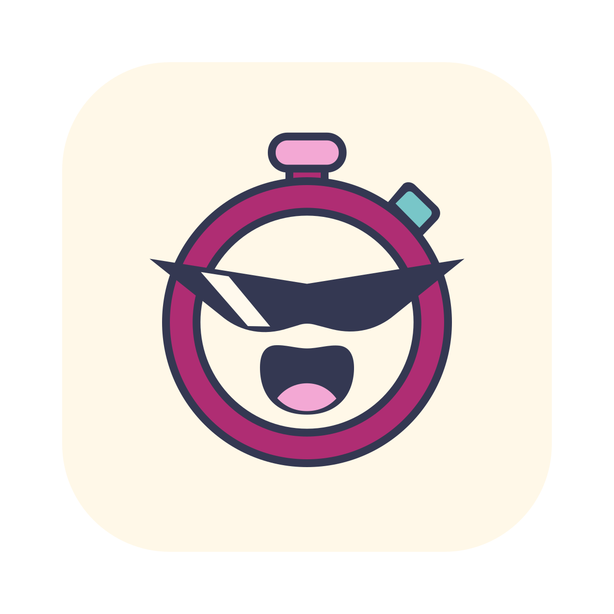
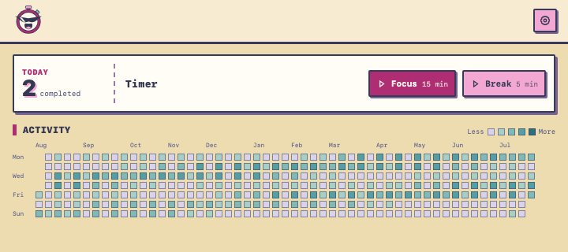
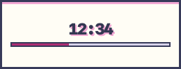
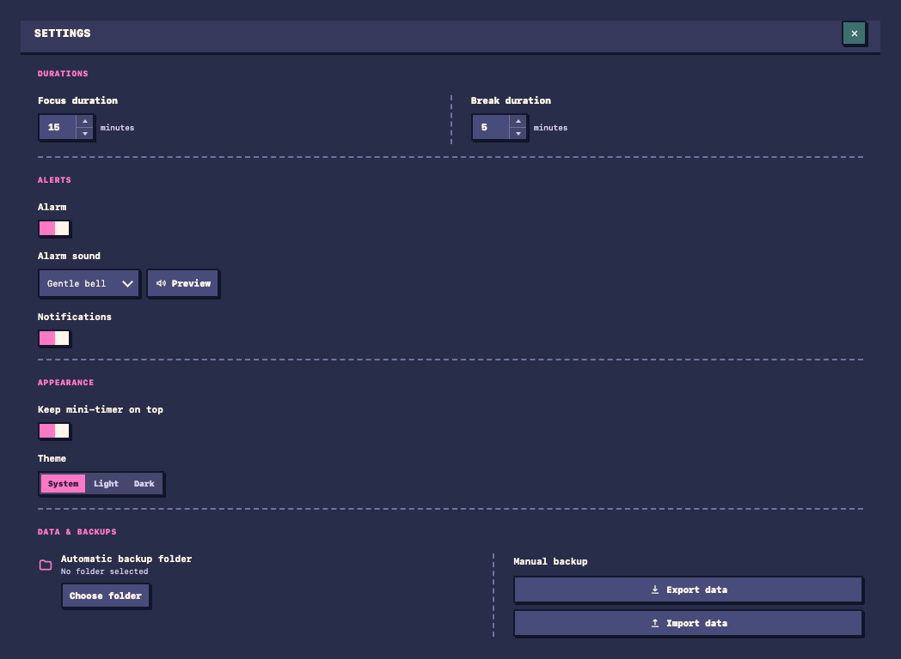

  

<h1 align="center">MicroTime</h1>

MicroTime is a small desktop focus timer for people who find starting harder
than continuing: procrastinators, people with ADHD or executive-function
difficulties, and anyone who feels overwhelmed by long productivity systems.

It combines low-effort focus sessions with a simple activity heatmap. Do
something small, finish it, and make the progress visible.

> [!WARNING]
> **MicroTime is a vibe-coded project.** Generative AI was used extensively to
> create and iterate on the code and documentation under human direction. The
> project is open source, but it has not received an independent security or
> accessibility audit and may contain mistakes. Review the source when relevant
> and keep backups of important data.

> [!IMPORTANT]
> **MicroTime is not a medical device or treatment.** It does not diagnose,
> treat, or cure ADHD, procrastination, or any other condition. The research
> below informs the design; it is not evidence that this app is clinically
> effective. If attention or task-initiation difficulties significantly affect
> your life, consider speaking with a qualified professional.

## Contents

- [The idea](#the-idea)
- [Download](#download)
- [Screenshots](#screenshots)
- [What it includes](#what-it-includes)
- [Why this approach](#why-this-approach)
- [Privacy and data](#privacy-and-data)
- [Project status](#project-status)
- [Issues and forks](#issues-and-forks)
- [License](#license)

## The idea

A long timer can feel like another task to avoid. MicroTime lowers the initial
commitment:

1. Pick a short focus duration — 15 minutes by default.
2. Start a session and keep the small floating countdown nearby.
3. When it ends, choose another focus session or take a break.
4. Every completed focus session adds a square to the 12-month heatmap.

Breaks and interrupted sessions never count. The heatmap is lightweight
gamification: no scores, rankings, accounts, or punishment for missing a day.

## Download

Download the installer for macOS, Windows, or Linux from the
[latest GitHub release](../../releases/latest). macOS is the primary platform
for the first version.

Some operating systems may warn about builds that are not yet signed or
notarized. Signing status and platform-specific details are included in the
release notes.

## Screenshots

## What it includes

- configurable focus sessions and breaks;
- a minimal floating countdown with an optional always-on-top mode;
- native alarms, notifications, and system tray controls;
- a 12-month heatmap of completed focus sessions;
- system, light, and dark themes;
- local data storage with JSON export, import, and optional daily backups;
- no accounts, telemetry, advertising, server, or cloud sync.

## Why this approach

The evidence behind MicroTime is indirect, but the design is consistent with a
few useful findings:

- A large meta-analysis found that task aversiveness, task delay, self-efficacy,
  and impulsiveness are among the strongest predictors of
  procrastination. MicroTime uses short sessions as a low-friction way to reduce
  the perceived commitment of starting a task.  
  [Steel, 2007 — *The nature of procrastination*](https://pubmed.ncbi.nlm.nih.gov/17201571/)
- In a randomized trial with adults with ADHD, a structured intervention focused
  on time management, organization, and planning performed better than
  supportive therapy. MicroTime borrows the idea of making time concrete and
  visible, but it is not a therapeutic intervention.  
  [Solanto et al., 2010 — *Efficacy of meta-cognitive therapy for adult ADHD*](https://pubmed.ncbi.nlm.nih.gov/20231319/)
- A meta-analysis of 138 experimental studies found that interventions that
  increased progress monitoring also improved goal attainment, with stronger
  effects when progress was recorded. The heatmap is MicroTime's quiet,
  persistent progress record.  
  [Harkin et al., 2016 — *Does monitoring goal progress promote goal attainment?*](https://pubmed.ncbi.nlm.nih.gov/26479070/)
- An experimental study found that specific gamification elements, including
  performance graphs, can affect perceived competence and task meaningfulness.
  The authors also stress that gamification is not effective by default, which
  is why MicroTime keeps it deliberately limited.  
  [Sailer et al., 2017 — *How gamification motivates*](https://doi.org/10.1016/j.chb.2016.12.033)

No study above evaluates MicroTime or establishes that a specific 15-minute
session is optimal. The default is a product choice, not a clinical claim.

## Privacy and data

Everything stays on the device. MicroTime stores sessions and settings locally
and does not require an account or network connection. Data can be exported to a
readable JSON backup and restored later.

## Project status

MicroTime is considered complete for its intended scope. It is in maintenance
mode: the focus is on keeping existing features reliable rather than expanding
the product or adding a roadmap.

## Issues and forks

Issues are welcome for reproducible bugs, broken releases, platform
compatibility problems, and accessibility issues. Please search the existing
issues before [opening a new one](../../issues/new).

The project is not actively seeking feature contributions or unsolicited pull
requests. If you want to change the workflow, interface, or product direction,
the recommended approach is to [fork the repository](../../fork) and make it
your own under the MIT license. Development notes for forks are available in
[CONTRIBUTING.md](CONTRIBUTING.md).

The backup format is documented in
[docs/BACKUP_FORMAT.md](docs/BACKUP_FORMAT.md).

## License

The source code is distributed under the [MIT license](LICENSE). The three
original alarm sounds are released under CC0 1.0; see
[public/sounds/LICENSE.md](public/sounds/LICENSE.md).
